# ERD - ENTITY RELATIONSHIP DIAGRAM

## Sơ đồ quan hệ Database - Hệ thống Quản lý Tuyển dụng & Đào tạo Thực tập sinh

```mermaid
erDiagram
    %% ============================================================================
    %% AUTHENTICATION & AUTHORIZATION
    %% ============================================================================

    users ||--o{ mentor_requests : creates
    users ||--o{ recruitment_plans : creates
    users ||--o{ job_positions : creates
    users ||--o{ interviews : conducts
    users ||--o{ onboarding : mentors
    users ||--o{ interns : mentors
    users ||--o{ learning_paths : creates
    users ||--o{ quizzes : creates
    users ||--o{ tasks : assigns
    users ||--o{ evaluations : evaluates
    users ||--o{ reports : reviews
    users ||--o{ notifications : receives
    users ||--o{ file_uploads : uploads
    users ||--o{ audit_logs : performs
    users ||--o{ task_comments : writes

    users }o--|| roles : has
    roles ||--o{ role_permissions : has
    permissions ||--o{ role_permissions : granted_to

    users {
        uuid id PK
        string full_name
        string email UK
        string password_hash
        string phone
        string avatar_url
        uuid role_id FK
        string status
        boolean email_verified
        timestamp email_verified_at
        timestamp last_login_at
        timestamp created_at
        timestamp updated_at
        timestamp deleted_at
    }

    roles {
        uuid id PK
        string name UK
        string display_name
        text description
        timestamp created_at
        timestamp updated_at
    }

    permissions {
        uuid id PK
        string name UK
        string display_name
        string module
        text description
        timestamp created_at
    }

    role_permissions {
        uuid role_id FK
        uuid permission_id FK
        timestamp created_at
    }

    %% ============================================================================
    %% RECRUITMENT MODULE
    %% ============================================================================

    mentor_requests {
        uuid id PK
        uuid mentor_id FK
        string title
        string department
        string position
        int quantity
        text required_skills
        date expected_start_date
        string priority
        string status
        text notes
        timestamp created_at
        timestamp updated_at
    }

    recruitment_plans ||--o{ job_positions : contains
    recruitment_plans {
        uuid id PK
        string name
        string batch
        string department
        text description
        date start_date
        date end_date
        string status
        uuid created_by FK
        uuid approved_by FK
        timestamp approved_at
        text rejection_reason
        timestamp created_at
        timestamp updated_at
    }

    job_positions ||--o{ candidates : receives
    job_positions {
        uuid id PK
        string code UK
        string title
        uuid recruitment_plan_id FK
        string department
        string level
        int required_quantity
        int filled_quantity
        text description
        text requirements
        text benefits
        string location
        string salary_range
        date posted_date
        date deadline
        string status
        uuid created_by FK
        timestamp created_at
        timestamp updated_at
    }

    candidates ||--o{ interviews : scheduled_for
    candidates ||--o{ onboarding : starts
    candidates {
        uuid id PK
        uuid user_id FK
        string full_name
        string email
        string phone
        string location
        string avatar_url
        text education
        text experience
        array skills
        string resume_url
        text cover_letter
        uuid applied_for_job_id FK
        date applied_date
        string status
        int match_score
        text rejection_reason
        timestamp created_at
        timestamp updated_at
    }

    interviews {
        uuid id PK
        uuid candidate_id FK
        uuid job_id FK
        date interview_date
        time interview_time
        int duration_minutes
        string format
        text location
        uuid interviewer_id FK
        string status
        string result
        text notes
        text feedback
        timestamp created_at
        timestamp updated_at
    }

    onboarding ||--o{ onboarding_steps : has
    onboarding ||--|| interns : converts_to
    onboarding {
        uuid id PK
        uuid candidate_id FK
        uuid intern_id FK
        string track
        uuid mentor_id FK
        string department
        date start_date
        int current_step
        string status
        timestamp created_at
        timestamp updated_at
        timestamp completed_at
    }

    onboarding_steps {
        uuid id PK
        uuid onboarding_id FK
        int step_number
        string title
        string status
        timestamp completed_at
        text notes
        timestamp created_at
        timestamp updated_at
    }

    %% ============================================================================
    %% TRAINING MODULE
    %% ============================================================================

    interns ||--o{ intern_progress : tracks
    interns ||--o{ tasks : assigned
    interns ||--o{ quiz_attempts : takes
    interns ||--o{ evaluations : receives
    interns ||--o{ reports : submits

    interns {
        uuid id PK
        uuid user_id FK
        string code UK
        uuid candidate_id FK
        string track
        uuid mentor_id FK
        string department
        date start_date
        date end_date
        string current_stage
        int overall_progress
        string status
        timestamp created_at
        timestamp updated_at
    }

    learning_paths ||--o{ modules : contains
    learning_paths ||--o{ quizzes : has_final_assessment
    learning_paths ||--o{ intern_progress : followed_by

    learning_paths {
        uuid id PK
        string track UK
        string title
        text description
        uuid created_by FK
        boolean is_active
        timestamp created_at
        timestamp updated_at
    }

    modules ||--o{ module_contents : contains
    modules ||--o{ quizzes : has

    modules {
        uuid id PK
        uuid learning_path_id FK
        string title
        text description
        int order_index
        string status
        int passing_score
        boolean is_required
        timestamp created_at
        timestamp updated_at
    }

    module_contents {
        uuid id PK
        uuid module_id FK
        string type
        string title
        text content_url
        jsonb metadata
        int order_index
        timestamp created_at
        timestamp updated_at
    }

    quizzes ||--o{ quiz_questions : contains
    quizzes ||--o{ quiz_attempts : taken_by

    quizzes {
        uuid id PK
        uuid module_id FK
        uuid learning_path_id FK
        string title
        text description
        string type
        int passing_score
        int time_limit_minutes
        int total_questions
        uuid created_by FK
        timestamp created_at
        timestamp updated_at
    }

    quiz_questions {
        uuid id PK
        uuid quiz_id FK
        text question_text
        string question_type
        jsonb options
        text correct_answer
        int points
        int order_index
        timestamp created_at
    }

    quiz_attempts {
        uuid id PK
        uuid quiz_id FK
        uuid intern_id FK
        timestamp started_at
        timestamp submitted_at
        int score
        int total_points
        string status
        jsonb answers
        timestamp created_at
    }

    intern_progress {
        uuid id PK
        uuid intern_id FK
        uuid learning_path_id FK
        uuid current_module_id FK
        array modules_completed
        int overall_progress
        timestamp created_at
        timestamp updated_at
    }

    tasks ||--o{ task_comments : has

    tasks {
        uuid id PK
        string code UK
        string title
        text description
        uuid intern_id FK
        uuid mentor_id FK
        string priority
        date due_date
        string status
        array attachments
        timestamp created_at
        timestamp updated_at
        timestamp completed_at
    }

    task_comments {
        uuid id PK
        uuid task_id FK
        uuid user_id FK
        text comment
        array attachments
        timestamp created_at
    }

    %% ============================================================================
    %% EVALUATION MODULE
    %% ============================================================================

    evaluations {
        uuid id PK
        uuid intern_id FK
        uuid mentor_id FK
        string type
        date evaluation_date
        int technical_score
        int attitude_score
        int teamwork_score
        int progress_score
        int overall_score
        text strengths
        text weaknesses
        text feedback
        string decision
        text decision_reason
        string status
        timestamp created_at
        timestamp updated_at
    }

    reports {
        uuid id PK
        uuid intern_id FK
        string type
        string period
        string title
        text content
        text challenges
        text next_plan
        timestamp submitted_at
        string status
        int score
        text feedback
        uuid reviewed_by FK
        timestamp reviewed_at
        timestamp created_at
        timestamp updated_at
    }

    %% ============================================================================
    %% SYSTEM TABLES
    %% ============================================================================

    notifications {
        uuid id PK
        uuid user_id FK
        string type
        string title
        text message
        jsonb data
        boolean is_read
        timestamp read_at
        timestamp created_at
    }

    email_templates ||--o{ email_logs : used_in

    email_templates {
        uuid id PK
        string code UK
        string name
        string subject
        text body
        jsonb variables
        timestamp created_at
        timestamp updated_at
    }

    email_logs {
        uuid id PK
        uuid template_id FK
        string recipient_email
        string subject
        text body
        string status
        text error_message
        timestamp sent_at
    }

    file_uploads {
        uuid id PK
        uuid uploaded_by FK
        string file_name
        text file_path
        bigint file_size
        string mime_type
        string entity_type
        uuid entity_id
        timestamp created_at
    }

    audit_logs {
        uuid id PK
        uuid user_id FK
        string action
        string entity_type
        uuid entity_id
        jsonb old_values
        jsonb new_values
        inet ip_address
        text user_agent
        timestamp created_at
    }

    system_settings {
        uuid id PK
        string key UK
        text value
        string data_type
        text description
        uuid updated_by FK
        timestamp created_at
        timestamp updated_at
    }
```



---

## Giải thích quan hệ chính

### 1. Recruitment Flow (Quy trình tuyển dụng)

```
Mentor → mentor_requests (Đề xuất)
    ↓
HR → recruitment_plans (Kế hoạch)
    ↓
HR → job_positions (Tin tuyển dụng)
    ↓
Candidate → candidates (Nộp hồ sơ)
    ↓
HR → interviews (Phỏng vấn)
    ↓
HR → onboarding (Onboarding)
    ↓
System → interns (Chuyển thành TTS)
```

### 2. Training Flow (Quy trình đào tạo)

```
Mentor → learning_paths (Tạo lộ trình)
    ↓
Mentor → modules (Tạo module)
    ↓
Mentor → module_contents (Thêm nội dung)
    ↓
Mentor → quizzes (Tạo quiz)
    ↓
Intern → quiz_attempts (Làm quiz)
    ↓
System → intern_progress (Cập nhật tiến độ)
```

### 3. Task Management Flow (Quản lý công việc)

```
Mentor → tasks (Giao task)
    ↓
Intern → tasks (Cập nhật status)
    ↓
Mentor/Intern → task_comments (Nhận xét)
    ↓
Mentor → tasks (Approve/Reject)
```

### 4. Evaluation Flow (Quy trình đánh giá)

```
Intern → reports (Nộp báo cáo)
    ↓
Mentor → reports (Review báo cáo)
    ↓
Mentor → evaluations (Đánh giá Phase 1/2/Final)
    ↓
System → Decision (Propose hire/Extend/End)
```

---

## Cardinality (Quan hệ số lượng)

| Quan hệ                           | Loại         | Mô tả                            |
| --------------------------------- | ------------ | -------------------------------- |
| users → roles                     | Many-to-One  | Nhiều users có 1 role            |
| roles → permissions               | Many-to-Many | Nhiều roles có nhiều permissions |
| recruitment_plans → job_positions | One-to-Many  | 1 plan có nhiều positions        |
| job_positions → candidates        | One-to-Many  | 1 position có nhiều candidates   |
| candidates → interviews           | One-to-Many  | 1 candidate có nhiều interviews  |
| candidates → onboarding           | One-to-One   | 1 candidate có 1 onboarding      |
| onboarding → interns              | One-to-One   | 1 onboarding tạo 1 intern        |
| learning_paths → modules          | One-to-Many  | 1 path có nhiều modules          |
| modules → quizzes                 | One-to-Many  | 1 module có nhiều quizzes        |
| quizzes → quiz_attempts           | One-to-Many  | 1 quiz có nhiều attempts         |
| interns → tasks                   | One-to-Many  | 1 intern có nhiều tasks          |
| interns → evaluations             | One-to-Many  | 1 intern có nhiều evaluations    |

---

## Cascade Rules (Quy tắc xóa)

| Parent Table   | Child Table      | ON DELETE |
| -------------- | ---------------- | --------- |
| roles          | role_permissions | CASCADE   |
| permissions    | role_permissions | CASCADE   |
| learning_paths | modules          | CASCADE   |
| modules        | module_contents  | CASCADE   |
| modules        | quizzes          | CASCADE   |
| quizzes        | quiz_questions   | CASCADE   |
| onboarding     | onboarding_steps | CASCADE   |
| tasks          | task_comments    | CASCADE   |
| interns        | intern_progress  | CASCADE   |

---

## Indexes Strategy

### Primary Indexes (Tự động)

- Tất cả các `id` (Primary Key)
- Tất cả các `UNIQUE` constraints

### Foreign Key Indexes

- Tất cả các `*_id` fields để tăng tốc JOIN

### Composite Indexes (Query phức tạp)

```sql
-- Tìm candidates theo job và status
idx_candidates_job_status (applied_for_job_id, status)

-- Tìm tasks theo intern và status
idx_tasks_intern_status (intern_id, status)

-- Tìm interviews theo date range
idx_interviews_date_range (interview_date, status)

-- Tìm evaluations theo intern và type
idx_evaluations_intern_type (intern_id, type)
```

### Partial Indexes (Tối ưu query cụ thể)

```sql
-- Chỉ index active users
CREATE INDEX idx_active_users ON users(id) WHERE status = 'active';

-- Chỉ index open job positions
CREATE INDEX idx_open_jobs ON job_positions(id) WHERE status = 'open';

-- Chỉ index unread notifications
CREATE INDEX idx_unread_notifications ON notifications(user_id) WHERE is_read = false;
```

---

## Data Integrity Rules

### Check Constraints

1. **Scores**: Tất cả điểm số phải từ 0-100
2. **Progress**: Tiến độ phải từ 0-100
3. **Match Score**: Match score phải từ 0-100
4. **Dates**: end_date >= start_date

### Unique Constraints

1. **users.email**: Email phải unique
2. **roles.name**: Tên role phải unique
3. **job_positions.code**: Mã job phải unique
4. **interns.code**: Mã intern phải unique
5. **tasks.code**: Mã task phải unique

### Not Null Constraints

- Tất cả các trường quan trọng (name, email, title, etc.)
- Foreign keys bắt buộc (role_id, mentor_id, etc.)

---

## Performance Considerations

### Partitioning Strategy

```sql
-- Partition audit_logs by month
CREATE TABLE audit_logs_2025_01 PARTITION OF audit_logs
    FOR VALUES FROM ('2025-01-01') TO ('2025-02-01');

-- Partition email_logs by month
CREATE TABLE email_logs_2025_01 PARTITION OF email_logs
    FOR VALUES FROM ('2025-01-01') TO ('2025-02-01');
```

### Materialized Views

```sql
-- Cache dashboard stats (refresh mỗi 5 phút)
CREATE MATERIALIZED VIEW mv_dashboard_stats AS
SELECT * FROM dashboard_stats;

CREATE UNIQUE INDEX ON mv_dashboard_stats (1);
```

---

## Security Considerations

### Row Level Security (RLS)

```sql
-- Mentor chỉ xem được interns của mình
ALTER TABLE interns ENABLE ROW LEVEL SECURITY;

CREATE POLICY mentor_interns_policy ON interns
    FOR SELECT
    USING (mentor_id = current_user_id());

-- Intern chỉ xem được tasks của mình
ALTER TABLE tasks ENABLE ROW LEVEL SECURITY;

CREATE POLICY intern_tasks_policy ON tasks
    FOR SELECT
    USING (intern_id = current_user_intern_id());
```

### Audit Trail

- Tất cả thao tác quan trọng được ghi vào `audit_logs`
- Trigger tự động ghi log khi INSERT/UPDATE/DELETE

---

## Backup Strategy

1. **Full Backup**: Mỗi ngày lúc 2:00 AM
2. **Incremental Backup**: Mỗi 6 giờ
3. **WAL Archiving**: Continuous
4. **Point-in-Time Recovery**: Enabled
5. **Retention**: 30 ngày

---

## Migration Path

### Phase 1: Core (Week 1)

- users, roles, permissions, role_permissions
- system_settings, notifications

### Phase 2: Recruitment (Week 2)

- mentor_requests, recruitment_plans, job_positions
- candidates, interviews

### Phase 3: Onboarding (Week 3)

- onboarding, onboarding_steps

### Phase 4: Training (Week 4)

- interns, learning_paths, modules, module_contents
- quizzes, quiz_questions, quiz_attempts

### Phase 5: Tasks & Evaluation (Week 5)

- tasks, task_comments
- evaluations, reports

### Phase 6: System (Week 6)

- email_templates, email_logs
- file_uploads, audit_logs
- Views, Functions, Triggers
